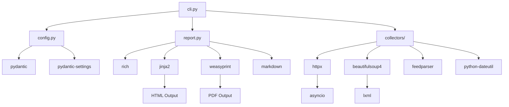

# QGIS News Gatherer - Package Documentation

## Overview

This document provides an annotated list of all packages in the software architecture.

## Core Dependencies

### HTTP & Networking

| Package | Version | Purpose |
|---------|---------|---------|
| `httpx` | >=0.27.0 | Async HTTP client for API requests and web scraping |
| `aiofiles` | >=24.1.0 | Async file I/O for caching and output |

### Parsing & Data Processing

| Package | Version | Purpose |
|---------|---------|---------|
| `beautifulsoup4` | >=4.12.0 | HTML parsing for web scraping |
| `lxml` | >=5.0.0 | Fast XML/HTML parser backend for BeautifulSoup |
| `feedparser` | >=6.0.0 | RSS/Atom feed parsing |
| `python-dateutil` | >=2.9.0 | Flexible date parsing |

### CLI & Output

| Package | Version | Purpose |
|---------|---------|---------|
| `click` | >=8.1.0 | CLI framework with decorators and options |
| `rich` | >=13.0.0 | Rich terminal output with colors, tables, progress bars |

### Configuration & Validation

| Package | Version | Purpose |
|---------|---------|---------|
| `pydantic` | >=2.0.0 | Data validation and settings management |
| `pydantic-settings` | >=2.0.0 | Environment variable loading for pydantic |

### PDF & Templating

| Package | Version | Purpose |
|---------|---------|---------|
| `weasyprint` | >=62.0 | HTML to PDF conversion for show notes |
| `markdown` | >=3.5.0 | Markdown to HTML conversion |
| `jinja2` | >=3.1.0 | Template engine for HTML/PDF generation |

## Development Dependencies

### Testing

| Package | Version | Purpose |
|---------|---------|---------|
| `pytest` | >=8.0.0 | Test framework |
| `pytest-asyncio` | >=0.23.0 | Async test support for pytest |
| `pytest-cov` | >=4.0.0 | Code coverage reporting |

### Code Quality

| Package | Version | Purpose |
|---------|---------|---------|
| `ruff` | >=0.3.0 | Fast linter and formatter (replaces flake8, isort, black) |
| `mypy` | >=1.8.0 | Static type checking |
| `pre-commit` | >=3.6.0 | Git hooks for automated checks |

### Type Stubs

| Package | Version | Purpose |
|---------|---------|---------|
| `types-beautifulsoup4` | >=4.12.0 | Type hints for BeautifulSoup |
| `types-python-dateutil` | >=2.9.0 | Type hints for dateutil |

## Documentation Dependencies

| Package | Version | Purpose |
|---------|---------|---------|
| `mkdocs` | >=1.5.0 | Documentation site generator |
| `mkdocs-material` | >=9.5.0 | Material theme for MkDocs |
| `mkdocstrings[python]` | >=0.24.0 | Auto-generate docs from docstrings |

## Repository Layout

```
.
├── src/qgis_news_gatherer/  # The package (see below)
├── tests/                   # Test suite
├── docs/                    # MkDocs documentation site
├── scripts/                 # Site build helpers
│   ├── generate_reports_index.py  # Builds the report archive page
│   └── sync_root_docs.py          # Mirrors root markdown into the site
├── .github/
│   ├── actions/publish-site/      # Shared docs build and deploy
│   └── workflows/                 # ci, docs, monthly-report
├── mkdocs.yml               # Documentation site configuration
└── flake.nix                # Reproducible dev environment
```

## Module Structure

```
qgis_news_gatherer/
├── __init__.py          # Package metadata and version
├── cli.py               # Click CLI entry point
├── config.py            # Settings and ReportConfig classes
├── report.py            # ReportGenerator for output
└── collectors/          # Data collector modules
    ├── __init__.py      # Collector exports
    ├── base.py          # BaseCollector, NewsItem, CollectorResult
    ├── github.py        # GitHub API collectors
    ├── feeds.py         # RSS/JSON feed collectors
    ├── changelog.py     # changelog.qgis.org scraper
    ├── conferences.py   # Conference info collector
    ├── mailing_lists.py # OSGeo mailing list archives
    ├── transifex.py     # Translation statistics
    ├── social.py        # Mastodon and Planet QGIS collectors
    ├── youtube.py       # YouTube video and Shorts collectors
    └── analytics.py     # Download statistics
```

## Dependency Graph



## Rationale

### Why httpx over requests?
- Native async support without additional libraries
- Modern API with good type hints
- HTTP/2 support
- Connection pooling built-in

### Why ruff over flake8/black/isort?
- Single tool replaces multiple (faster CI)
- Much faster execution (Rust-based)
- Compatible rule sets
- Active development

### Why pydantic for config?
- Automatic environment variable loading
- Type validation
- Default values
- Easy serialization

### Why rich for output?
- Beautiful terminal output
- Markdown rendering
- Progress bars
- Tables and panels
- Cross-platform color support

### Why weasyprint for PDF?
- Pure Python (no external dependencies like wkhtmltopdf)
- Excellent CSS support for professional styling
- Page numbering and headers/footers
- Good font handling
- Active maintenance

### Why jinja2 for templating?
- Industry standard Python templating
- Powerful template inheritance
- Used by many frameworks (Flask, Django)
- Easy to maintain templates
- Good documentation
