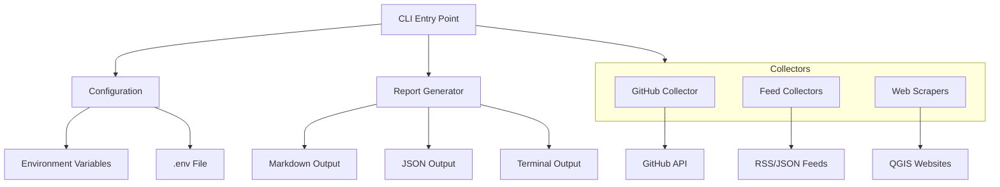
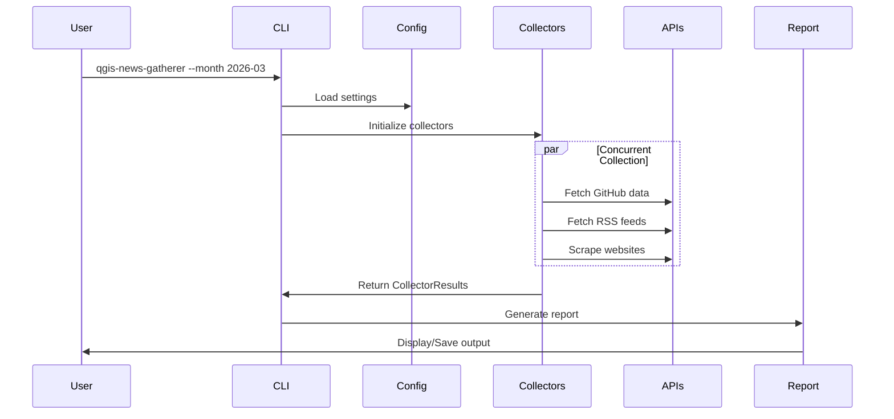

<!-- SPDX-FileCopyrightText: 2026 Kartoza <info@kartoza.com> -->
<!-- SPDX-License-Identifier: GPL-3.0-or-later -->
<!-- Mirrored from the repository root by scripts/sync_root_docs.py. -->

# QGIS News Gatherer - Specification

## 1. Overview

QGIS News Gatherer is a Python CLI tool that automates the collection of content for QGIS monthly YouTube news segments. The tool aggregates information from multiple QGIS project sources and generates organized reports.

## 2. User Stories

### US-001: Generate Monthly News Report
**As a** QGIS community manager
**I want to** automatically gather all QGIS-related news for a specific month
**So that** I can efficiently prepare content for the monthly YouTube news segment

**Acceptance Criteria:**
- Tool collects data from all configured sources
- Data is filtered to the target month
- Report is generated in the requested format
- Errors in individual collectors don't prevent other collectors from running

### US-002: Select Specific Sections
**As a** content creator
**I want to** choose which sections to include in the report
**So that** I can focus on specific topics

**Acceptance Criteria:**
- CLI accepts a comma-separated list of section names
- Only specified sections are collected
- Invalid section names produce helpful error messages

### US-003: View Available Sections
**As a** user
**I want to** see what sections are available
**So that** I can choose which to include

**Acceptance Criteria:**
- `--list-sections` flag displays all available sections
- Each section shows its name and description

### US-004: Configure API Tokens
**As a** user
**I want to** provide API tokens for authenticated services
**So that** I can access rate-limited APIs and authenticated data

**Acceptance Criteria:**
- Tokens can be set via environment variables
- Tokens can be set via `.env` file
- Missing required tokens produce clear warnings
- Optional tokens enhance functionality when present

### US-005: Export Report Formats
**As a** user
**I want to** export reports in different formats
**So that** I can use them in various workflows

**Acceptance Criteria:**
- Markdown format for documentation/sharing
- JSON format for programmatic processing
- Terminal format for quick review
- PDF format for sharing with team/audience
- YouTube description format ready to paste
- HTML format for web viewing

### US-006: Video Chapter Generation
**As a** video producer
**I want to** automatically generate video chapter timestamps
**So that** I can easily add chapters to my YouTube video

**Acceptance Criteria:**
- Timestamps are calculated based on section content
- Chapters include all sections with content
- Output is in YouTube-compatible format (MM:SS Title)
- Can be displayed standalone with --show-chapters

### US-007: YouTube Description Generation
**As a** video producer
**I want to** generate a complete YouTube description
**So that** I can quickly publish my video with all relevant information

**Acceptance Criteria:**
- Includes video chapters with timestamps
- Includes all relevant links from the content
- Includes standard QGIS resources links
- Includes community links
- Includes call to action (subscribe, donate)
- Ready to copy/paste into YouTube

### US-008: PDF Show Notes
**As a** content creator
**I want to** generate beautiful PDF show notes
**So that** I can share them with my audience and team

**Acceptance Criteria:**
- Professional styling with QGIS branding colors
- Includes summary statistics
- Includes video chapters
- Includes all news items organized by section
- Includes all links
- Includes Kartoza footer
- Printable A4 format

## 3. Functional Requirements

### FR-001: Data Collection
- **FR-001.1**: Collect QGIS releases from GitHub API
- **FR-001.2**: Collect notable bug fixes from merged PRs
- **FR-001.3**: Collect blog posts from blog.qgis.org RSS feed
- **FR-001.4**: Collect news items from feed.qgis.org
- **FR-001.5**: Collect QEP updates from GitHub
- **FR-001.6**: Collect website changes from QGIS-Website repo
- **FR-001.7**: Collect conference/event information
- **FR-001.8**: Collect mailing list highlights
- **FR-001.9**: Collect translation statistics from Transifex
- **FR-001.10**: Collect GitHub Discussions highlights
- **FR-001.11**: Collect QGIS-related YouTube videos published in the month
- **FR-001.12**: Collect QGIS-related YouTube Shorts published in the month

### FR-004: Publication

- **FR-004.1**: Publish a MkDocs documentation site to GitHub Pages
- **FR-004.2**: Generate the monthly report automatically on the last Thursday
  of each month at 06:00 UTC
- **FR-004.3**: Publish each generated PDF to the site's report archive,
  preserving previously published reports
- **FR-004.4**: Generate the archive index page from the published PDFs

### FR-002: Date Filtering
- **FR-002.1**: Default to current calendar month
- **FR-002.2**: Accept custom month via `--month YYYY-MM` flag
- **FR-002.3**: Filter all items to the specified month

### FR-003: Report Generation
- **FR-003.1**: Generate markdown show notes with talking points
- **FR-003.2**: Generate JSON with structured data including chapters
- **FR-003.3**: Display formatted output in terminal
- **FR-003.4**: Include section headers and item counts
- **FR-003.5**: Include Kartoza footer with links
- **FR-003.6**: Generate PDF with professional styling
- **FR-003.7**: Generate YouTube description with chapters
- **FR-003.8**: Generate HTML for web viewing
- **FR-003.9**: Calculate video chapter timestamps
- **FR-003.10**: Collect and deduplicate all links
- **FR-003.11**: Render YouTube sections as badged video cards with an
  infographic: stat tiles (count, tutorials, combined views, change vs
  last month) and a month-on-month grouped bar chart

### FR-004: Error Handling
- **FR-004.1**: Continue collection if individual sources fail
- **FR-004.2**: Report errors and warnings per section
- **FR-004.3**: Provide verbose mode for debugging

### FR-005: Configuration
- **FR-005.1**: Load settings from environment variables
- **FR-005.2**: Load settings from `.env` file
- **FR-005.3**: Support GitHub personal access token
- **FR-005.4**: Support Transifex API token

## 4. Non-Functional Requirements

### NFR-001: Performance
- Concurrent data collection using async/await
- Maximum 5 concurrent HTTP requests
- Request timeout of 30 seconds

### NFR-002: Reliability
- Graceful degradation when sources fail
- Cache responses to avoid repeated requests (1 hour TTL)

### NFR-003: Security
- API tokens never logged or displayed
- Tokens stored in environment variables only

### NFR-004: Usability
- Clear CLI help messages
- Progress indication during collection
- Colored terminal output

## 5. Architecture

### 5.1 Component Diagram



### 5.2 Data Flow



## 6. Data Models

### 6.1 NewsItem
```python
@dataclass
class NewsItem:
    title: str
    url: str | None
    description: str | None
    date: date | None
    author: str | None
    category: str | None
    tags: list[str]
    metadata: dict[str, Any]
```

### 6.2 CollectorResult
```python
@dataclass
class CollectorResult:
    section_name: str
    section_title: str
    items: list[NewsItem]
    error: str | None
    warnings: list[str]
```

## 7. API Endpoints

### 7.1 GitHub API
- `GET /repos/{owner}/{repo}/releases` - Releases
- `GET /search/issues` - PR search
- `POST /graphql` - Discussions (GraphQL)

### 7.2 RSS Feeds
- `https://blog.qgis.org/feed/` - QGIS Blog
- `https://plugins.qgis.org/planet/feed/atom/` - Planet QGIS

### 7.3 JSON Feeds
- `https://feed.qgis.org/sketches/sketches.json` - News Feed

### 7.4 YouTube

YouTube offers no key-less search API, so the collectors parse the
`ytInitialData` JSON embedded in the search results page:

- `https://www.youtube.com/results?search_query={query}&sp=EgIIBA%3D%3D`

The `sp` filter restricts results to uploads from the current month and
applies no type filter, so long form videos and Shorts are both returned.
Results are read from the `videoRenderer`, `reelItemRenderer` and
`shortsLockupViewModel` nodes wherever they appear in the document.

Known limitations:

- Long form results carry a relative upload date ("3 days ago") which is
  resolved to an approximate date. Shorts carry no date at all, so they are
  only included when the report targets the current month.
- Because YouTube only reports the current month, month-on-month comparison
  is built from counts each run records in
  `{cache_dir}/youtube_history.json`. Comparisons therefore start from the
  first month the tool is run.

## 8. CLI Interface

```
Usage: qgis-news-gatherer [OPTIONS]

Options:
  -m, --month TEXT        Target month in YYYY-MM format
  -o, --output PATH       Output file path
  -f, --format FORMAT     Output format: terminal, markdown, json, pdf, youtube, html
  -s, --sections TEXT     Comma-separated list of sections
  -v, --verbose           Enable verbose output
  --list-sections         List available sections
  --show-chapters         Show video chapters only
  --show-youtube-desc     Show YouTube description only
  --version               Show version
  --help                  Show help
```

### Output Format Details

| Format | Extension | Description |
|--------|-----------|-------------|
| terminal | - | Rich terminal display with colors and tables |
| markdown | .md | Full show notes with talking points and links |
| json | .json | Structured data including chapters and all links |
| pdf | .pdf | Professional PDF with QGIS branding |
| youtube | .txt | YouTube description ready to paste |
| html | .html | HTML version for web or printing |

## 9. Testing Requirements

### 9.1 Unit Tests
- Configuration loading
- Date filtering logic
- Report generation
- NewsItem and CollectorResult serialization

### 9.2 Integration Tests
- End-to-end CLI execution
- Real API responses (with mocking)

## 10. Documentation Requirements

- README with quick start guide
- CLI help messages
- API documentation
- Contributing guidelines

## 11. Version History

| Version | Date | Changes |
|---------|------|---------|
| 0.1.0 | 2026-03-19 | Initial implementation |
