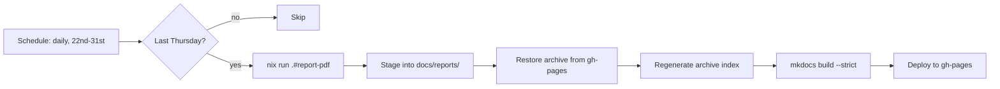

<!-- SPDX-FileCopyrightText: 2026 Kartoza <info@kartoza.com> -->
<!-- SPDX-License-Identifier: GPL-3.0-or-later -->

# Monthly Automation

The last Thursday of every month at 06:00 UTC, a GitHub Action gathers the
month, renders the PDF and publishes it to the [report
archive](../reports/index.md).



## Why the schedule looks odd

Cron has no way to say "the last Thursday". Worse, when a cron expression
restricts both day-of-month and day-of-week, the two are ORed rather than
ANDed &mdash; so `0 6 22-28 * 4` would fire on *every* day from the 22nd to
the 28th *and* on every Thursday.

So the workflow fires daily across the end of the month:

```yaml
schedule:
  - cron: '0 6 22-31 * *'
```

and a gate job decides whether today qualifies:

```bash
weekday="$(date -u +%u)"
this_month="$(date -u +%m)"
next_week_month="$(date -u -d '+7 days' +%m)"
if [ "$weekday" = "4" ] && [ "$this_month" != "$next_week_month" ]; then
  # It is Thursday, and a week from now is next month: last Thursday.
fi
```

The 22nd-31st window matters. The last Thursday can fall as late as the 31st,
so a 22-28 window would miss it in most months.

## Running it by hand

The workflow has a `workflow_dispatch` trigger with an optional month:

```bash
gh workflow run monthly-report.yml
gh workflow run monthly-report.yml -f month=2026-03
```

A manual run skips the date gate.

!!! warning "Past months lose their Shorts"

    Regenerating an old month works, but YouTube Shorts carry no publish date
    and are only kept for the current month &mdash; see [YouTube
    sections](../user-guide/youtube.md). A back-filled report will show few or
    no Shorts.

## What the job needs

| Secret | Required | Purpose |
|--------|----------|---------|
| `GITHUB_TOKEN` | Automatic | Supplied by Actions; lifts the GitHub API rate limit |
| `TRANSIFEX_TOKEN` | Optional | Enables the `translations` section |

Add the optional one with:

```bash
gh secret set TRANSIFEX_TOKEN
```

Without it the run still succeeds; the translations section is simply empty.

## Why Nix in CI

The report job installs Nix and runs `nix run .#report-pdf`, rather than
pip-installing WeasyPrint. The flake pins the Noto font set, including CJK and
colour emoji. Community content routinely contains both, and without those
faces the PDF fills with missing-glyph boxes. Using the flake means the
published PDF is byte-for-byte the kind of thing a maintainer builds locally.

The docs build uses plain pip, matching the existing CI workflow &mdash; it
only needs MkDocs.

## How the archive survives a redeploy

The PDFs live on the `gh-pages` branch under `reports/`, which is also where
the site itself is published. Every build therefore:

1. checks out `gh-pages` into a temporary path,
2. copies existing `reports/*.pdf` into `docs/reports/` with `cp -n`, so a
   report generated earlier in the same run wins,
3. regenerates `docs/reports/index.md` from whatever is now on disk,
4. builds and deploys with `keep_files: true`.

Both the docs workflow and the monthly workflow share this through the
composite action at `.github/actions/publish-site`, so the archive logic
exists once. They also share a `github-pages` concurrency group so the two can
never write to the branch at the same time.

!!! note "keep_files means deletions linger"

    Because the deploy keeps existing files, a documentation page you delete
    stays on the published site until someone clears the branch. That is a
    deliberate trade: losing a month's report is worse than an orphaned page.

## Enabling Pages the first time

After the first successful deploy, point Pages at the branch:

```bash
gh api -X POST repos/timlinux/qgis-news-gatherer/pages \
  -f 'source[branch]=gh-pages' -f 'source[path]=/'
```

Or in the web UI: **Settings → Pages → Deploy from a branch → gh-pages / (root)**.

## When it fails

- **The section is empty** &mdash; check the run log; each collector logs its
  own failure and the run continues.
- **The whole job fails** &mdash; usually the PDF step. Look for a WeasyPrint
  or font error.
- **Nothing ran at all** &mdash; check the gate job's log; it prints the date
  it evaluated and why it skipped. GitHub also disables scheduled workflows in
  repositories with no activity for 60 days.
