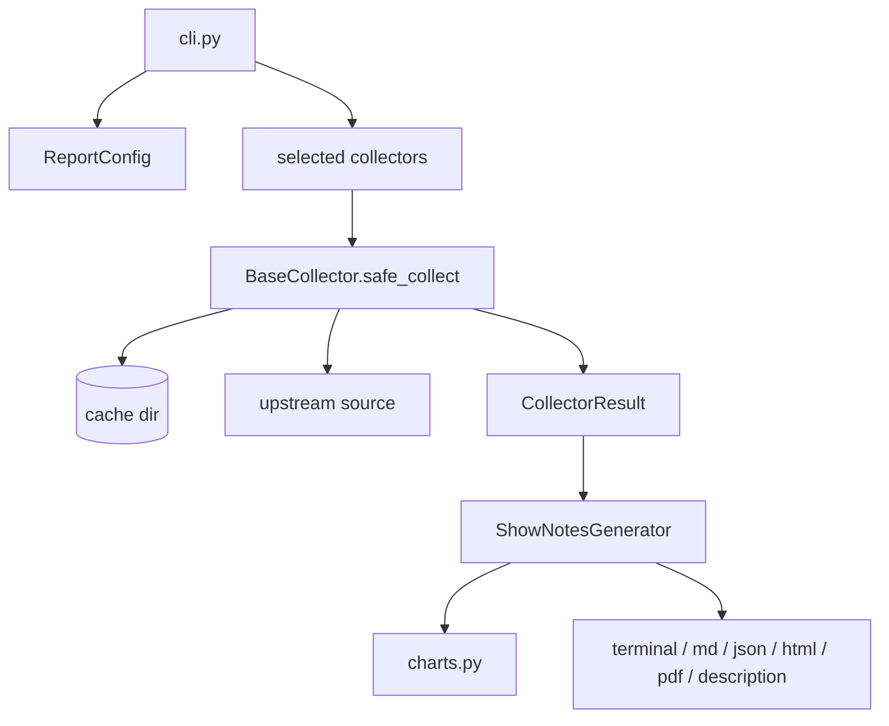

<!-- SPDX-FileCopyrightText: 2026 Kartoza <info@kartoza.com> -->
<!-- SPDX-License-Identifier: GPL-3.0-or-later -->

# Project Structure

```
qgis_news_gatherer/
├── __init__.py          # Package metadata and version
├── cli.py               # Click entry point, section to collector map
├── config.py            # Settings (env) and ReportConfig (per run)
├── charts.py            # Inline SVG chart primitives
├── report.py            # ShowNotesGenerator: every output format
└── collectors/
    ├── base.py          # BaseCollector, NewsItem, CollectorResult
    ├── github.py        # Releases, PRs, QEPs, website, discussions
    ├── feeds.py         # Blog and news feeds
    ├── changelog.py     # changelog.qgis.org
    ├── conferences.py   # Events
    ├── mailing_lists.py # OSGeo list archives
    ├── discourse.py     # OSGeo Discourse
    ├── psc.py           # Steering committee minutes
    ├── members.py       # Sustaining members
    ├── user_groups.py   # User group registry
    ├── transifex.py     # Translation statistics
    ├── analytics.py     # Usage and plugin statistics
    ├── social.py        # Mastodon and Planet QGIS
    └── youtube.py       # Videos and Shorts
```

## How a run flows



1. `cli.py` builds a `ReportConfig` for the target month and resolves the
   requested section names to collector classes.
2. Each collector runs through `safe_collect()`, which handles caching, HTTP
   errors, timeouts and stale-cache fallback. A failure becomes a
   `CollectorResult` carrying an error, never an exception that stops the run.
3. Results are handed to `ShowNotesGenerator`, which renders whichever format
   was asked for.

## The three data types

```python
@dataclass
class NewsItem:
    title: str
    url: str | None = None
    description: str | None = None
    date: date | None = None
    author: str | None = None
    category: str | None = None
    tags: list[str] = field(default_factory=list)
    metadata: dict[str, Any] = field(default_factory=dict)
```

`metadata` is the extension point. Anything a section needs that does not fit
the common fields &mdash; view counts, chart series, member levels, logos
&mdash; lives there, and the report reads it by key.

`CollectorResult` wraps a section's items with its `section_name`,
`section_title`, optional `error` and any `warnings`.

`ReportConfig` holds the target month and exposes `month_start()` and
`month_end()`, which `BaseCollector.is_in_month()` uses for date filtering.

## Charts

`charts.py` renders inline SVG with no JavaScript, because the PDF renderer
cannot execute any. Primitives: `horizontal_bar_chart`, `time_series_chart`,
`pie_chart` and `grouped_bar_chart`.

A collector opts in by emitting a summary `NewsItem` with a
`metadata["metric"]` key; `generate_analytics_charts()` matches on the section
name and metric, and returns the SVG for the report to embed.
